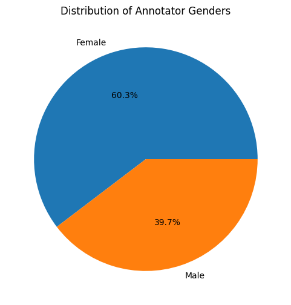
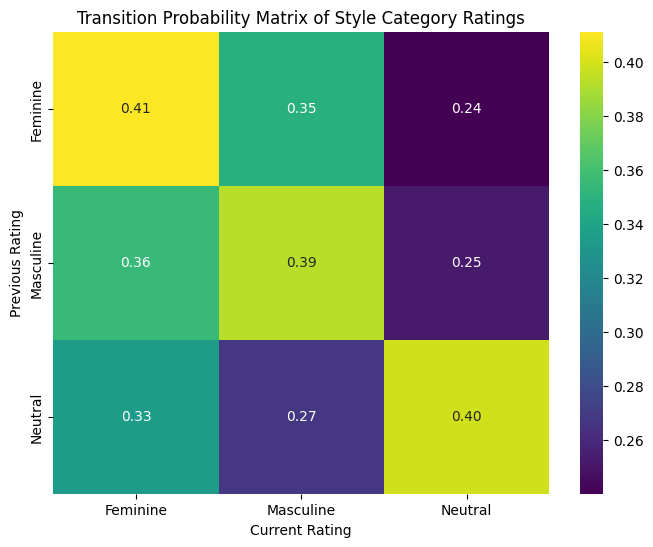
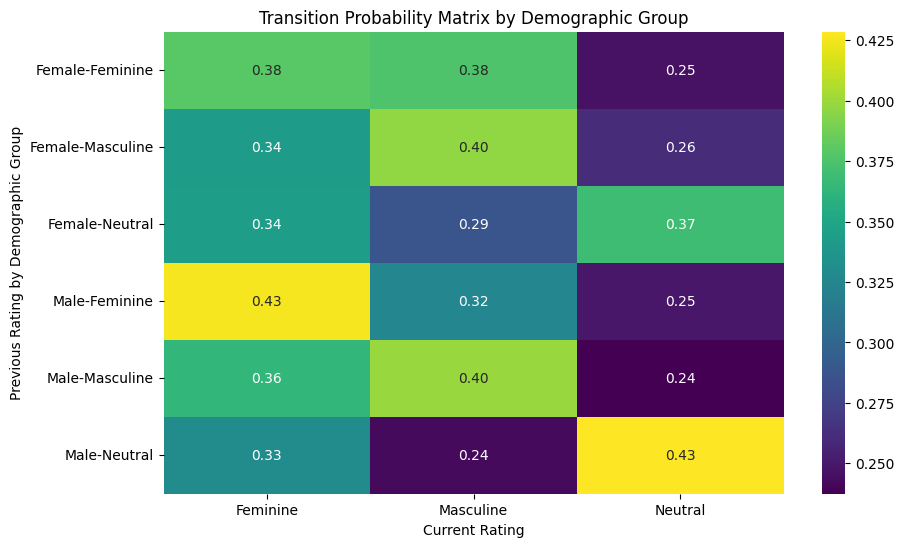

```python
import pandas as pd
import numpy as np
import matplotlib.pyplot as plt
import seaborn as sns
from statsmodels.stats.inter_rater import fleiss_kappa
from krippendorff import alpha
from scipy.stats import zscore
from pandas import crosstab

```


```python

def load_data():
    return pd.read_csv("pre_first_batch_merged_demo.csv")# 230 texts style 29 NAs, confidence 19 NAs, filled up with 3 and 2
df = load_data()
```


```python
df['text_id'] = df['text_id'].fillna('unknown')
```


```python

text_counts = df['short_text'].value_counts()
print(text_counts)
assert all(text_counts == 10), "Each text should have exactly 10 annotations. Check dataset integrity."


```

    short_text
    Getting transportation is a trouble. If you do not personal a automobile and you live in a large metropolis, this could be specifically genuine. You're heading to uncover that there are a whole lot of diverse issues to offer with in regards to obtaining about, and when it's time to transfer forwa...                                                                                                                                                                                                                      10
    Its Saturday and its supposed to be the weekend .. Internationally at least... unfortunately, over here, I'm not so lucky.. Well, its my off day but due to some warped up system over here. Only Friday is the weekend... every other day, its a busy work week. Now is that even fair? But who are we to judge? I was working on Friday while everyone was out having their fun .. fairness has been out of my dictionary a long time when I was back home working in an industry which required me to work 7 days a week...    10
    Thank you God!!! You have said you will provide us with what we need and you definitely showed it tonight! The spaghetti dinner we had to raise money for Melinda's mission trip to france brought in over $800! I was hoping for $300. I mean, this being the first thing the youth group has done like this and all, i wasn't sure what would happen. For a while i was kind of doubting a good turn out.                                                                                                                       10
    I called Mom and asked her to read the recipe to me over the phone. I had made it many times so I really just needed the ingredients. I made the fudge, there in my own kitchen far from home and it tasted just as good as it did at home. 1 c. sugar 1 c. brown sugar 3/4 c. milk 2 Tbs. light corn syrup 3 Tbs. butter 1/2 c. or more peanut butter 1 tsp vanilla Mix sugars, milk, and corn syrup in a pan and cook until the soft ball stage.                                                                                10
    I ran a 10 Miler on May 15th. I was slightly disappointed that I bonked at mile 7. I still finished the distance, but I noticed a drastic *increase* in mile pace once my body started to shut down. I didn't hydrate properly the night before... and I didn't fuel during the run. It's so strange that one forgets that the body needs energy too. Over all I was proud of myself for keeping my committment to cover the miles...                                                                                             10
                                                                                                                                                                                                                                                                                                                                                                                                                                                                                                                                      ..
    There's nothing we love more than to have a friend get together. We just listen to everything we have to share while we all sit on the couches We like to get comfortable as we are all the best of friends. Some of s try to listen more by pulling our ear open a little more. It is nice to have them all in the same room to share all our favorite moments of life.                                                                                                                                                          10
    This Christmas was my baby's Benji first. Noni gave him lots of kisses. Everyone gathered together to open gifts. Beji got a stuffed animal for christmas. Benji got the perfect piggy bank and we named it rainy.                                                                                                                                                                                                                                                                                                                10
    When the Prophet Muhammad, blessings and peace be upon his noble soul, conquered Mecca, not a single drop of blood was shed. Almost every prisoner was forgiven in the end, and each and every one of them, enlightened by the peace and mercy radiating from the faith, reverted to Islam. The very peop...                                                                                                                                                                                                                      10
    hey ya'all. how are you doing? i am fine today. well i just wanted to tell everyone i talk to at least that i am leaving to go to wyoming. i might of told some of you and some of you might of already knew, but it was great telling you, cuz i hope my cousins think it's kinda cool that i'm coming u...                                                                                                                                                                                                                      10
    There was a huge freeway where many people were driving. One person was sick so he got out of his car to stretch his legs. All the cars were stopped and people started taking pictures of him. Others sat down with him to take pictures. People were so excited they decided to start laying down in the middle of the freeway.                                                                                                                                                                                                 10
    Name: count, Length: 230, dtype: int64


```python
# Outlier Detection
annotator_means = df.groupby('p_id')['style_score'].mean()
annotator_std = df.groupby('p_id')['style_score'].std()
outlier_annotators = annotator_means[(np.abs(zscore(annotator_means)) > 2)].index
print("Outlier Annotators (Mean-based):", outlier_annotators.tolist())
```

    Outlier Annotators (Mean-based): ['667196e97423e7565c192fb8', '67a512649c0c090e741461df@email.prolific.com']


```python

rating_counts_per_text = df.groupby(['short_text', 'style_score']).size().unstack(fill_value=0)

```

# Distribution of Annotations


```python

rating_counts = df['style_score'].value_counts().sort_index()

majority_vote = rating_counts_per_text.idxmax(axis=1)
majority_vote_counts = majority_vote.value_counts(normalize=True) * 100  # Convert to percentage

plt.figure(figsize=(8, 5))
sns.barplot(x=majority_vote_counts.index, y=majority_vote_counts.values, palette='viridis')
plt.title("Percentage Distribution of Majority Vote Ratings Per Text")
plt.xlabel("Majority Vote Rating")
plt.ylabel("Percentage (%)")
plt.xticks([1, 2, 3, 4, 5])
plt.show()

print("Majority Vote Percentage Distribution:")
print(majority_vote_counts)

```

    /var/folders/v0/d34g1sz16y97yl7402_8zx380000gn/T/ipykernel_37153/372595182.py:8: FutureWarning: 
    
    Passing `palette` without assigning `hue` is deprecated and will be removed in v0.14.0. Assign the `x` variable to `hue` and set `legend=False` for the same effect.
    
      sns.barplot(x=majority_vote_counts.index, y=majority_vote_counts.values, palette='viridis')


    

    


    Majority Vote Percentage Distribution:
    3    34.782609
    2    28.260870
    4    19.130435
    1    13.043478
    5     4.782609
    Name: proportion, dtype: float64


```python
df['label'] = df['label'].str.lower().map({'female': 'female', 'male': 'male', 'non-binary': 'non-binary'})
```


```python
if 'label' in df.columns:
    plt.figure(figsize=(10, 5))

    # Adjust KDE bandwidth using bw_adjust
    sns.histplot(df['label'], bins=10, kde=True, color="skyblue", kde_kws={"bw_adjust": 3})

    plt.title("Distribution of the Sex of the Author")
    plt.xlabel("Sex of the Author")
    plt.ylabel("Count")

    plt.show()
```


    

    


```python
# Distribution of Demographics
if 'Age' in df.columns:
    plt.figure(figsize=(10, 5))
    sns.histplot(df['Age'], bins=10, kde=True)
    plt.title("Distribution of Annotator Ages")
    plt.xlabel("Age")
    plt.ylabel("Count")
    plt.show()

if 'Sex' in df.columns:
    gender_counts = df.drop_duplicates('p_id')['Sex'].value_counts()
    plt.figure(figsize=(6, 6))
    plt.pie(gender_counts, labels=gender_counts.index, autopct='%1.1f%%')
    plt.title("Distribution of Annotator Genders")
    plt.show()


```


    

    


    

    


# Inter-Annotator Agreement Analysis


```python

print("Per-Rating Agreement and Disagreement Scores:")
agreement_scores = {}
disagreement_scores = {}
for rating in range(1, 6):
    binary_annotations = df.pivot(index='short_text', columns='p_id', values='style_score').applymap(lambda x: 1 if x == rating else 0)
    rating_counts = binary_annotations.sum(axis=1).values.reshape(-1, 1)

    # Fleiss' Kappa Agreement for this rating
    kappa_score = fleiss_kappa(np.hstack([rating_counts, 10 - rating_counts]))  # 10 annotators per text

    # Krippendorff's Alpha Agreement for this rating
    alpha_score = alpha(binary_annotations.values, level_of_measurement='nominal')

    # Compute Disagreement as 1 - Agreement
    disagreement_score = 1 - max(kappa_score, 0)

    agreement_scores[rating] = {'Fleiss Kappa': kappa_score, 'Krippendorff Alpha': alpha_score}
    disagreement_scores[rating] = disagreement_score
    print(f"Rating {rating}: Fleiss' Kappa = {kappa_score:.3f}, Krippendorff's Alpha = {alpha_score:.3f}, Disagreement = {disagreement_score:.3f}")
```

    Per-Rating Agreement and Disagreement Scores:
    Rating 1: Fleiss' Kappa = 0.116, Krippendorff's Alpha = 0.010, Disagreement = 0.884
    Rating 2: Fleiss' Kappa = 0.103, Krippendorff's Alpha = 0.003, Disagreement = 0.897
    Rating 3: Fleiss' Kappa = 0.020, Krippendorff's Alpha = 0.014, Disagreement = 0.980
    Rating 4: Fleiss' Kappa = 0.056, Krippendorff's Alpha = 0.005, Disagreement = 0.944
    Rating 5: Fleiss' Kappa = 0.070, Krippendorff's Alpha = 0.009, Disagreement = 0.930


    /var/folders/v0/d34g1sz16y97yl7402_8zx380000gn/T/ipykernel_37153/1227359378.py:5: FutureWarning: DataFrame.applymap has been deprecated. Use DataFrame.map instead.
      binary_annotations = df.pivot(index='short_text', columns='p_id', values='style_score').applymap(lambda x: 1 if x == rating else 0)
    /var/folders/v0/d34g1sz16y97yl7402_8zx380000gn/T/ipykernel_37153/1227359378.py:5: FutureWarning: DataFrame.applymap has been deprecated. Use DataFrame.map instead.
      binary_annotations = df.pivot(index='short_text', columns='p_id', values='style_score').applymap(lambda x: 1 if x == rating else 0)
    /var/folders/v0/d34g1sz16y97yl7402_8zx380000gn/T/ipykernel_37153/1227359378.py:5: FutureWarning: DataFrame.applymap has been deprecated. Use DataFrame.map instead.
      binary_annotations = df.pivot(index='short_text', columns='p_id', values='style_score').applymap(lambda x: 1 if x == rating else 0)
    /var/folders/v0/d34g1sz16y97yl7402_8zx380000gn/T/ipykernel_37153/1227359378.py:5: FutureWarning: DataFrame.applymap has been deprecated. Use DataFrame.map instead.
      binary_annotations = df.pivot(index='short_text', columns='p_id', values='style_score').applymap(lambda x: 1 if x == rating else 0)
    /var/folders/v0/d34g1sz16y97yl7402_8zx380000gn/T/ipykernel_37153/1227359378.py:5: FutureWarning: DataFrame.applymap has been deprecated. Use DataFrame.map instead.
      binary_annotations = df.pivot(index='short_text', columns='p_id', values='style_score').applymap(lambda x: 1 if x == rating else 0)


```python

def map_gender_category(rating):
    if rating in [1, 2]:
        return 'Feminine'
    elif rating in [4, 5]:
        return 'Masculine'
    else:
        return 'Neutral'
```


```python
df['style_category'] = df['style_score'].apply(map_gender_category)
```


```python

gender_counts_per_text = df.groupby(['short_text', 'style_category']).size().unstack(fill_value=0)


gender_counts = df['style_category'].value_counts(normalize=True) * 100
plt.figure(figsize=(8, 5))
sns.barplot(x=gender_counts.index, y=gender_counts.values, palette='viridis')
plt.title("Overall Distribution of Gender Style")
plt.xlabel("Style Category")
plt.ylabel("Percentage (%)")
plt.show()


majority_vote = gender_counts_per_text.idxmax(axis=1)
plt.figure(figsize=(8, 5))
sns.histplot(majority_vote, discrete=True, kde=False, palette='viridis')
plt.title("Distribution of Majority Vote Gender Styles Per Text")
plt.xlabel("Majority Vote Gender Style")
plt.ylabel("Count")
plt.show()

```

    /var/folders/v0/d34g1sz16y97yl7402_8zx380000gn/T/ipykernel_37153/4084481776.py:7: FutureWarning: 
    
    Passing `palette` without assigning `hue` is deprecated and will be removed in v0.14.0. Assign the `x` variable to `hue` and set `legend=False` for the same effect.
    
      sns.barplot(x=gender_counts.index, y=gender_counts.values, palette='viridis')


    

    


    /var/folders/v0/d34g1sz16y97yl7402_8zx380000gn/T/ipykernel_37153/4084481776.py:16: UserWarning: Ignoring `palette` because no `hue` variable has been assigned.
      sns.histplot(majority_vote, discrete=True, kde=False, palette='viridis')


    

    


```python

census_counts = (gender_counts_per_text == 10).sum()
census_percentages = (census_counts / len(gender_counts_per_text)) * 100


most_consensus = census_percentages.idxmax()
least_consensus = census_percentages.idxmin()

print("Percentage of Texts Reaching Full Consensus for Each Category:")
print(census_percentages)
print(f"Category with Most Consensus: {most_consensus} ({census_percentages[most_consensus]:.2f}%)")
print(f"Category with Least Consensus: {least_consensus} ({census_percentages[least_consensus]:.2f}%)")

```

    Percentage of Texts Reaching Full Consensus for Each Category:
    style_category
    Feminine     0.869565
    Masculine    0.000000
    Neutral      0.000000
    dtype: float64
    Category with Most Consensus: Feminine (0.87%)
    Category with Least Consensus: Masculine (0.00%)


```python

disagreement_counts = (gender_counts_per_text > 0).sum(axis=1) == gender_counts_per_text.shape[1]
disagreement_percentage = (disagreement_counts.sum() / len(gender_counts_per_text)) * 100


disagreement_by_category = (gender_counts_per_text > 0).sum() / len(gender_counts_per_text) * 100
most_disagreement = disagreement_by_category.idxmax()
least_disagreement = disagreement_by_category.idxmin()

print(f"Percentage of Texts with Full Disagreement: {disagreement_percentage:.2f}%")
print("Percentage of Disagreement for Each Category:")
print(disagreement_by_category)
print(f"Category with Most Disagreement: {most_disagreement} ({disagreement_by_category[most_disagreement]:.2f}%)")
print(f"Category with Least Disagreement: {least_disagreement} ({disagreement_by_category[least_disagreement]:.2f}%)")
```

    Percentage of Texts with Full Disagreement: 76.52%
    Percentage of Disagreement for Each Category:
    style_category
    Feminine     90.000000
    Masculine    91.304348
    Neutral      94.347826
    dtype: float64
    Category with Most Disagreement: Neutral (94.35%)
    Category with Least Disagreement: Feminine (90.00%)


```python


annotator_votes = df.pivot(index='short_text', columns='p_id', values='style_category')
conf_matrix_data = []
true_labels = []

for text in majority_vote.index:
    majority_label = majority_vote[text]
    annotator_labels = annotator_votes.loc[text].dropna().values
    true_labels.extend([majority_label] * len(annotator_labels))
    conf_matrix_data.extend(annotator_labels)


cm = crosstab(pd.Series(true_labels, name='Majority Vote'), pd.Series(conf_matrix_data, name="Annotator's Rating"))


cm_normalized = cm.div(cm.sum(axis=1), axis=0) * 100


plt.figure(figsize=(6, 5))
sns.heatmap(cm_normalized, annot=True, fmt='.2f', cmap='viridis', xticklabels=['Feminine', 'Neutral', 'Masculine'], yticklabels=['Feminine', 'Neutral', 'Masculine'])
plt.title("Normalized Confusion Matrix: Annotator Ratings vs. Majority Vote (%)")
plt.xlabel("Annotator's Rating")
plt.ylabel("Majority Vote")
plt.show()

```

    Percentage of Texts with Full Disagreement: 76.52%
    Percentage of Disagreement for Each Category:
    style_category
    Feminine     90.000000
    Masculine    91.304348
    Neutral      94.347826
    dtype: float64
    Category with Most Disagreement: Neutral (94.35%)
    Category with Least Disagreement: Feminine (90.00%)


    

    


```python

annotator_agreement = {}
for annotator in df['p_id'].unique():
    annotator_ratings = df[df['p_id'] == annotator].groupby('short_text')['style_category'].first()
    annotator_ratings = annotator_ratings.reindex(majority_vote.index, fill_value=np.nan)  # Align indices
    agreement_count = (annotator_ratings == majority_vote).sum()
    total_annotations = annotator_ratings.notna().sum()
    annotator_agreement[annotator] = (agreement_count / total_annotations) * 100 if total_annotations > 0 else np.nan


annotator_agreement_df = pd.DataFrame.from_dict(annotator_agreement, orient='index', columns=['Agreement Percentage'])
annotator_agreement_df = annotator_agreement_df.dropna().sort_values(by='Agreement Percentage')


```


```python

if 'Sex' in df.columns:
    annotator_demographics = df[['p_id', 'Sex']].drop_duplicates()
    merged_df = annotator_agreement_df.merge(annotator_demographics, left_index=True, right_on='p_id')
    plt.figure(figsize=(10, 5))
    sns.boxplot(x='Sex', y='Agreement Percentage', data=merged_df, palette='viridis')
    plt.title("Agreement Percentage by Demographic Group")
    plt.xlabel("Demographic Group")
    plt.ylabel("Agreement Percentage (%)")
    plt.xticks(rotation=45)
    plt.show()

    print("Per-Demographic Group Agreement:")
    print(merged_df.groupby('Sex')['Agreement Percentage'].describe())
```

    /var/folders/v0/d34g1sz16y97yl7402_8zx380000gn/T/ipykernel_37153/3406860698.py:6: FutureWarning: 
    
    Passing `palette` without assigning `hue` is deprecated and will be removed in v0.14.0. Assign the `x` variable to `hue` and set `legend=False` for the same effect.
    
      sns.boxplot(x='Sex', y='Agreement Percentage', data=merged_df, palette='viridis')


    

    


    Per-Demographic Group Agreement:
            count       mean        std   min        25%   50%    75%        max
    Sex                                                                         
    Female   35.0  58.190476  11.444820  27.5  52.916667  57.5  66.25  76.666667
    Male     23.0  55.289855  12.155892  20.0  50.000000  55.0  60.00  80.000000


```python

df_sorted = df.sort_values(by=['p_id', 'short_text'])
df_sorted['previous_rating'] = df_sorted.groupby('p_id')['style_category'].shift(1)


transition_matrix = pd.crosstab(df_sorted['previous_rating'], df_sorted['style_category'], normalize='index')

plt.figure(figsize=(8, 6))
sns.heatmap(transition_matrix, annot=True, cmap='viridis', fmt='.2f')
plt.title("Transition Probability Matrix of Style Category Ratings")
plt.xlabel("Current Rating")
plt.ylabel("Previous Rating")
plt.show()


df_sorted['binary_transition'] = (df_sorted['style_category'] == df_sorted['previous_rating']).astype(int)
autocorr = df_sorted.groupby('p_id')['binary_transition'].mean()

plt.figure(figsize=(8, 5))
sns.histplot(autocorr, kde=True, bins=20, color='purple')
plt.title("Distribution of Annotator Autocorrelation in Style Category Ratings")
plt.xlabel("Autocorrelation (Likelihood of Repeating Previous Label)")
plt.ylabel("Number of Annotators")
plt.show()

print("Mean Autocorrelation Across Annotators:")
print(autocorr.mean())
```


    

    


    

    


    Mean Autocorrelation Across Annotators:
    0.39055555555555554


```python
# Compute Autocorrelation: Does Previous Rating Predict Next Rating?


# Compare Sequential Rating Patterns Between Demographic Groups
if 'Sex' in df.columns:
    demographic_transition = df_sorted.groupby(['Sex', 'previous_rating'])['style_category'].value_counts(normalize=True).unstack(fill_value=0)

    plt.figure(figsize=(10, 6))
    sns.heatmap(demographic_transition, annot=True, cmap='viridis', fmt='.2f')
    plt.title("Transition Probability Matrix by Demographic Group")
    plt.xlabel("Current Rating")
    plt.ylabel("Previous Rating by Demographic Group")
    plt.show()

    print("Transition Probability Matrix by Demographic Group:")
    print(demographic_transition)
```


    

    


    Transition Probability Matrix by Demographic Group:
    style_category          Feminine  Masculine   Neutral
    Sex    previous_rating                               
    Female Feminine         0.379237   0.375000  0.245763
           Masculine        0.342672   0.396552  0.260776
           Neutral          0.343008   0.287599  0.369393
    Male   Feminine         0.425868   0.324921  0.249211
           Masculine        0.363309   0.399281  0.237410
           Neutral          0.329365   0.242063  0.428571


```python

```
